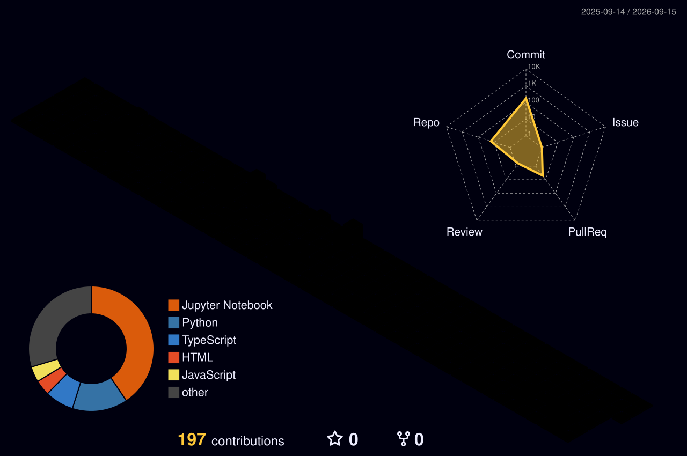

<div align="center">

<!-- ===== ANIMATED DOT-PORTRAIT BANNER ===== -->
<picture>
  <!-- <source media="(prefers-color-scheme: dark)" srcset="https://raw.githubusercontent.com/AnuragAgrahari04/AnuragAgrahari04/main/dark.svg"> -->
  <source media="(prefers-color-scheme: light)" srcset="https://raw.githubusercontent.com/AnuragAgrahari04/AnuragAgrahari04/main/light.svg">
  
</picture>

<!-- ===== TYPING ANIMATION ===== -->
<a href="https://git.io/typing-svg">
  
</a>

<br/>

<!-- ===== VISITOR COUNTER ===== -->

&nbsp;


</div>


<!-- ===== ABOUT ME ===== -->
```yaml
name        : Anurag Agrahari
alias       : AnuragAgrahari04
college     : IET Lucknow, B.Tech CSE (AI) — 2023–2027
focus       : ["ML/DL Engineering", "GenAI & RAG Pipelines", "LLM Fine-tuning"]
building    : LLM-powered apps, RAG pipelines, ML healthcare & civic platforms
ask_me_about: ["PyTorch", "LangChain", "RAG", "Deep Learning", "Docker"]
reach_me_at : [LinkedIn, Kaggle, Codeforces, CodeChef, HackerRank]
status      : "Actively seeking ML / GenAI internships & roles 🚀"
```


## <b> Skills</b>

**Programming Languages:**
<p align="left">
   &nbsp;
   &nbsp;
   &nbsp;
   &nbsp;
   &nbsp;
</p>

**Developer Tools & OS:**
<p align="left">
   &nbsp;
   &nbsp;
   &nbsp;
   &nbsp;
</p>

**ML/DL & Data Tools:**
<p align="left">
   &nbsp;
   &nbsp;
   &nbsp;
   &nbsp;
   &nbsp;
   &nbsp;
   &nbsp;
   &nbsp;
</p>

**Platforms:**
<p align="left">
  
  
  
  
</p>


## 🚀 Key Projects

### 🏛️ Gov-Complaint-Box
Full-stack AI-powered government grievance management system enabling citizens to submit complaints via text, image, or voice. Automated urgency classification and department routing using **LLaMA3 (Groq)** + **LangChain**, with **Salesforce BLIP** for image captioning, **Groq Whisper** for voice transcription, and **Sentence Transformers** for duplicate detection. React admin portal featuring analytics and a geo-heatmap, deployed on Render + Vercel.

### 🏥 Medicate
Full-stack AI healthcare platform built with **Django 4.2** and **scikit-learn**, achieving **97% disease prediction accuracy** across 42 diseases from 132 symptoms. End-to-end doctor appointment booking with OTP verification, admin approval workflows, real-time WebSocket chat, and video consultations via **Agora SDK**. Integrated a **Gemini-powered AI medical assistant** and live doctor discovery via OpenStreetMap. Deployed on Render with PostgreSQL, Redis, and Daphne ASGI.


## 🏆 Competitive Programming

<div align="center">

| Platform | Profile | Rating |
|:--------:|:-------:|:------:|
|  | [anurag042004](https://codeforces.com/profile/anurag042004) | 🟢 **Pupil** (1231) |
|  | [ideal_apple_04](https://www.codechef.com/users/ideal_apple_04) | 🔵 **1684** (+52) |
|  | [Agrahari_04](https://leetcode.com/u/Agrahari_04/) | 🟠 **Contest 1587** · Top 26.12% |

</div>

### 🎯 Highlights
- 🏆 **Global Rank 309** in CodeChef Starters 216 (Rated)
- 📊 **113/4042** problems solved on LeetCode across Easy/Medium/Hard, 107 submissions in the past year, max streak of 7 days
- ⚡ Actively participating in rated contests across Codeforces and CodeChef


## <b> GitHub Stats</b>

<div align="center">
  
  
</div>

<p align="center">
  
</p>


## 📈 Activity Graph

<div align="center">
  
</div>


## 🐍 Contribution Snake

<div align="center">
  <picture>
    <source media="(prefers-color-scheme: dark)" srcset="https://raw.githubusercontent.com/AnuragAgrahari04/AnuragAgrahari04/output/github-snake-dark.svg" />
    <source media="(prefers-color-scheme: light)" srcset="https://raw.githubusercontent.com/AnuragAgrahari04/AnuragAgrahari04/output/github-snake.svg" />
    
  </picture>
</div>


## 📊 3D Contribution Graph

<div align="center">
  
</div>


## 🌐 Socials

<p align="left">
  <a href="https://www.linkedin.com/in/anurag-agrahari-a3b6552a6/" target="_blank"></a>
  <a href="https://www.kaggle.com/anuragagrahari2003" target="_blank"></a>
  <a href="https://instagram.com/anurag_agrahari_04" target="_blank"></a>
  <a href="https://www.codechef.com/users/ideal_apple_04" target="_blank"></a>
  <a href="https://www.hackerrank.com/anurag_042004" target="_blank"></a>
  <a href="https://codeforces.com/profile/anurag042004" target="_blank"></a>
</p>

<div align="center">
  <i>⚡ "Every model is wrong, but the useful ones ship." — Anurag Agrahari</i>
</div>
